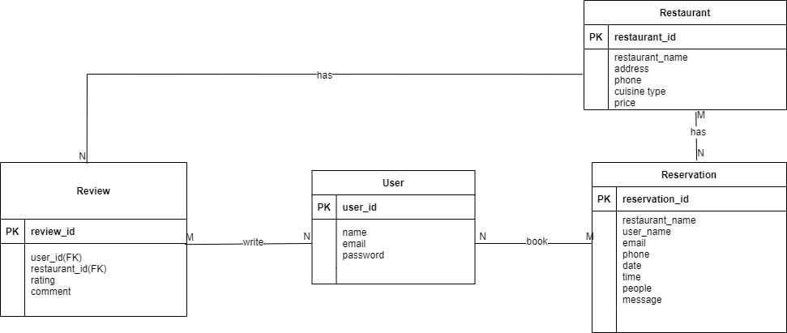

# 
# KULLIYYAH OF INFORMATION AND COMMUNICATION TECHNOLOGY
# INFO 3305 WEB APPLICATION DEVELOPMENT
# PROJECT PROPOSAL
# SECTION 1 (SEM 2 2023/2024)
# INSTRUCTOR: MOHD KHAIRUL AZMI BIN HASSAN
| NO  | NAME                                | MATRIC NO |
|:---:|                :---                 |   :---:   |
| 1   | AHMAD IMAN BIN TURIN                | 2123349   |
| 2   | MUHAMMAD ANAS REDZA BIN MATT ZAIDI  | 2128877   |
| 3   | MUHAMMAD AZRI BIN BURHAN            | 2211585   |
| 4   | AHMAD AZAMUDDIN BIN MOHD ZAINUDDIN  | 2215501   |
## 1.0 Project Title
DineConnect

## 2.0 Introduction
By developing a comprehensive online platform where users can find, book, review, recommend, discuss, and chat about restaurants, the DineConnect initiative seeks to redefine the dining experience. Foodies and restaurant owners have different needs, and Restaurant Hub combines essential elements to meet those needs while also improving user interaction and pleasure.

## 3.0 Objective
The objective of this project is to:
- Give customers an easy way to make reservations for the restaurants of their choosing.
* Encourage sincere and educational restaurant evaluations and ratings from actual patrons.
- Encourage a community-driven setting where people can exchange ideas and talk about their dining experiences.
* Improve user communication by implementing real-time chat features.

## 4.0 Features and Functionalities

### 4.1 Login Page
1. User can login and will be directed to the home page
2. User can click sign up and will be directed to the sign up page.

### 4.2 Sign Up Page
1. User can sign up on this page and will be directed to the home page.

### 4.3 Home Page
1. Featured restaurants carousel/slider showcasing images and promotions.
2. Search bar with filters (location, cuisine, price range) for finding restaurants.
3. Quick links to popular cuisines or locations for easy navigation.

### 4.4 Restaurant Listings Page
1. List of restaurants based on search criteria with images and brief descriptions.
2. Filters (location, cuisine, price range) for refining search results.

### 4.5 Restaurant Detail Page
1. Restaurant information (address, contact details, hours of operation).
2. Reviews and ratings section with option to read/write reviews and rate different aspects.
3. Photo gallery showcasing the restaurant's ambiance and dishes.
4. Menu display (if available) with pricing information.
5. Related restaurants or similar recommendations based on user preferences.

### 4.6 Booking Page
1. Search filters for finding restaurants based on location, cuisine, and availability.
2. Calendar or date picker for selecting booking dates.
3. Time slots for selecting reservation times.
4. Confirmation page with booking details, options for cancellations, and payment (if required).

### 4.7 Review and Rating Page
1. Form for leaving reviews and ratings for food quality, service, ambiance, etc.
2. Recent reviews and average ratings displayed prominently for user reference.

## 5.0 Entity Relation Diagram
### 
## 6.0 Sequence Diagram
### 

## 7.0 Project System Captured Screen and Explanation
1. Login Page and Register Page
   Consist of welcoming text,register page for first time user and login page for existing user
### 
### 
### 
2. Main Page
   Consist of welcoming text, about us, restaurant listing, team members, and contact info
### 
### 
### 
### 
### 
3. Restaurant Listing Page
   Consist of name, address, phone number, cuisine type and price of the available restaurants.
### 
4. Restaurant Detail Page
   Consist of detail of the restaurant,deleting and adding the restaurants.
### 
### 
5. Booking List Page
   Consist of list of booked restaurant and name of customer.Also contain name, email, phone, date, time, number of people, and message.
### 
6. Booking List Page
   Consist of form to book the restaurant at desired time and date
### 
## 8.0 Challenge/Difficulties to Develop the Application
1.Miscommunication between group members.
2.Wrong data type between controller and database.
3.Error like bugs and technical glitches arise unexpectedly during development.
4.Merge conflict where we can't commit the files.
